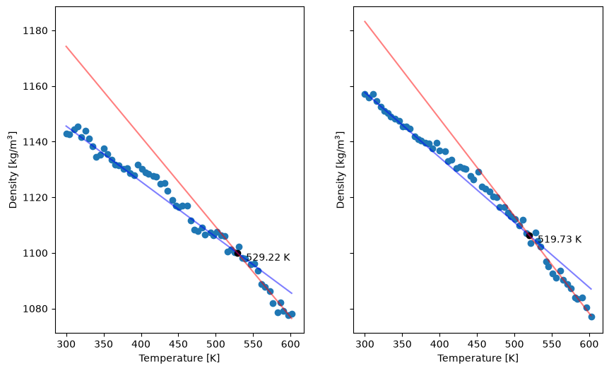

.. _badcy_postsim:

Post-build simulations and analyses
-----------------------------------

The canonical worked example for the postsim + analyze subsystems is
:ref:`tutorial 3 <tutorials_postsim_analyses>`; the workflow for
BADCy is identical save for the input filenames and a few
system-specific timings.  This page lists the postsim YAML and a few
BADCy-specific notes.

postsim.yaml
^^^^^^^^^^^^

.. code-block:: yaml

    - anneal:
        input_top: systems/final-results/final.top
        input_gro: systems/final-results/final.gro
        P: 1
        T0: 300
        T1: 600
        ncycles: 2
        T0_to_T1_ps: 10
        T1_ps: 10
        T1_to_T0_ps: 10
        T0_ps: 10
    - equilibrate:
        input_top: systems/final-results/final.top
        input_gro: postsim/anneal/anneal.gro
        T: 300
        ps: 10
    - ladder:
        input_top: systems/final-results/final.top
        input_gro: postsim/equilibrate/equilibrate.gro
        subdir: postsim/ladder-heat
        Tlo: 300
        Thi: 600
        deltaT: 5
        ps_per_rise: 10
        ps_per_run: 90
        warmup_ps: 10
    - ladder:
        input_top: systems/final-results/final.top
        input_gro: postsim/ladder-heat/ladder.gro
        subdir: postsim/ladder-cool
        Tlo: 300
        Thi: 600
        deltaT: -5
        ps_per_rise: 10
        ps_per_run: 90
        warmup_ps: 10
    - deform:
        input_top: systems/final-results/final.top
        input_gro: postsim/equilibrate/equilibrate.gro
        subdir: postsim/deform-x
        T: 300
        P: 1
        direction: x
        edot: 0.001
        ps: 40
        replicas: 3
    - deform:
        input_top: systems/final-results/final.top
        input_gro: postsim/equilibrate/equilibrate.gro
        subdir: postsim/deform-y
        T: 300
        P: 1
        direction: y
        edot: 0.001
        ps: 40
        replicas: 3
    - deform:
        input_top: systems/final-results/final.top
        input_gro: postsim/equilibrate/equilibrate.gro
        subdir: postsim/deform-z
        T: 300
        P: 1
        direction: z
        edot: 0.001
        ps: 40
        replicas: 3

Run it:

.. code-block:: console

    $ htpolynet postsim -cfg postsim.yaml -ocfg 6-cyanate-ester.yaml -proj proj-0

The numbers below come from the GPU reference build described on the
:ref:`results page <badcy_results>`.  Each ladder is 60 rungs of 100 ps, 6 ns in all,
and the whole post-build sequence took 30 minutes on one V100.  The moduli come from a
separate set of pulls on the same structure, described below.

Density
^^^^^^^

.. warning::

   The density the postcure stage ends at -- 1149.5 kg/m³ here -- is **not** an
   equilibrated density.  This example's postcure anneal peaks at 500 K, and the glass
   transition measured below is 520-530 K, so the anneal never takes the network above
   *T*:sub:`g`, where it could rearrange.  The cooling ladder, which starts at 600 K,
   ends at 1157.0 kg/m³ at 300 K, 0.7 % denser.  Take densities from the cooling ladder,
   not from the end of the build.

``proj-0/postsim/anneal/rho_v_ns.png`` and ``proj-0/postsim/equilibrate/rho_v_ns.png``
show the density through the post-build anneal and equilibration.

Glass-transition temperature
^^^^^^^^^^^^^^^^^^^^^^^^^^^^

After ``postsim`` finishes, fit *T*:sub:`g` with:

.. code-block:: console

    $ htpolynet plots post --cfg postsim.yaml --proj proj-0

This writes ``tg.png`` and one CSV per ladder in ``proj-0/plots/``.

   Density vs. temperature on the heating ladder (left) and the cooling ladder (right),
   each with its glassy and rubbery fits.  *T*:sub:`g` is where the two lines cross:
   529.2 K (256.1 °C) heating and 519.7 K (246.6 °C) cooling, both at 0.05 K/ps.

Two things to keep in mind when comparing these with a DSC or DMA measurement.  The
ladder heats and cools at 0.05 K/ps, many orders of magnitude faster than any
experiment, and a faster rate raises the apparent *T*:sub:`g`.  And this is one build
of 360 monomers: the 10 K gap between heating and cooling is a fair indication of how
far apart two estimates from the same structure can fall.

Young's modulus
^^^^^^^^^^^^^^^

``plots post`` also fits Young's modulus to the ``deform`` stages: it fits each pull --
every direction, every replica -- over ``fit_strain``, and reports *E* as the mean of
those fits with the standard error between them, writing ``e.png``, ``E.csv`` and the
individual fits to ``E-fits.csv``.

The ``deform`` stanzas above are the defaults, written out: each pull runs 40 ps at
``edot: 0.001`` to 4 % strain, *E* is fitted over 0.1-3 %, and each direction is pulled
three times, nine pulls in all.  Those defaults were chosen on this network.  Fifteen
pulls to 10 % strain -- five along each axis -- gave:

.. list-table::
   :header-rows: 1
   :widths: 30 40

   * - Direction
     - *E*, fitted over 0.1-3 % strain
   * - x
     - 3.33 ± 0.21 GPa
   * - y
     - 2.54 ± 0.23 GPa
   * - z
     - 2.13 ± 0.29 GPa
   * - all fifteen
     - **2.67 ± 0.19 GPa**

The directions differ by more than their error bars.  A box of 360 monomers is not
isotropic, so the overall figure is an isotropic estimate, and part of its error bar is
that anisotropy.  Fitted beyond about 4 % strain the slope falls -- 2.2 GPa to 5 %,
1.7 GPa to 8 % -- because the network starts to yield, so a wider window buys a smaller
error bar with a biased number.

Shorter pulls cannot resolve *E* at all.  The reference build's first postsim run used
10 ps pulls, reaching 1 % strain, and on a box of 13662 atoms the pressure fluctuates by
several hundred bar -- more than the stress a 1 % strain produces.  Fitted to 2 %, one
pull scattered by 80 %; to 3 %, by 30 %.

Free volume
^^^^^^^^^^^

Use ``htpolynet analyze`` to invoke ``gmx freevolume`` on the
equilibration trajectory.  Create ``fv.yaml``:

.. code-block:: yaml

    - command: freevolume

Then:

.. code-block:: console

    $ htpolynet analyze -cfg fv.yaml -proj proj-0

``proj-0/analyze/freevolume/ffv.dat`` reports a fractional free volume of
0.213 ± 0.001 for this build, with a molecular volume of 146.5 nm³ against a van der
Waals volume of 88.7 nm³.

A note on interpretation
^^^^^^^^^^^^^^^^^^^^^^^^

This network is at 97.5 % cyanate conversion, built by the reaction that cures the
real material.  Its 18 unreacted groups are intact -O-C#N end groups, which is what an
incompletely cured BADCy contains, so nothing about its composition is an artifact of
the model.  What remains model-dependent is the usual list for any simulated thermoset:
the GAFF force field with ``gas`` charges, a box of 360 monomers, a cure protocol whose
MD between iterations is far shorter than a real cure schedule, and properties measured
at simulation rates.
