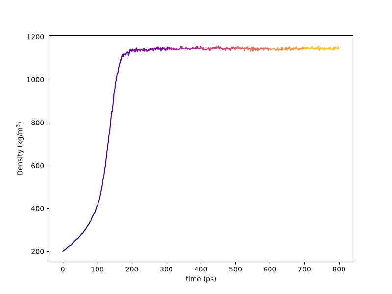
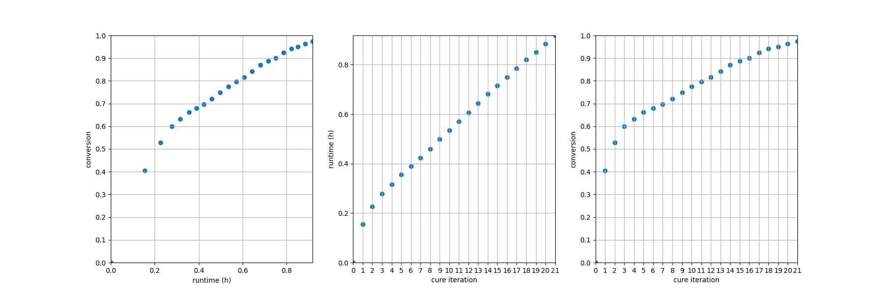
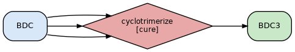

.. _badcy_results:

Results
-------

The numbers and figures on this page come from the reference build of the 2.15.0
configuration: htpolynet at commit ``6ca6406``, run through the container on one V100
GPU with 16 CPU cores.  A second build of the same configuration with every ``mdrun``
offload turned off is quoted alongside where the two differ.

The standard final-results bundle is in ``proj-0/systems/final-results/``:

.. code-block:: console

   $ vmd final.viz.psf final.gro -e final.viz.tcl

Diagnostic-log plots:

.. code-block:: console

   $ htpolynet plots diag --diags diagnostics.log

   Density vs. time during densification of the BDC liquid, from 200 kg/m³.  The
   NPT stage was extended three times before its mean density was known to within the
   configured 1 kg/m³; it converged at 1145.7 ± 0.4 kg/m³.

   Left: cyanate conversion vs. wall-clock time.  Middle: wall-clock time vs. ring-cure
   iteration.  Right: conversion vs. iteration.  The first iteration closes 97 rings and
   reaches 0.404; the last eleven close between two and seven rings each.

   The reaction network: one reaction, ``cyclotrimerize``, taking three BDC and making
   the trimer template BDC3.

The conversion on these plots is the cyanate conversion -- groups consumed over groups
present -- which is the quantity FTIR measures at 2270 cm\ :sup:`-1`, so it can be
compared with experiment directly.

.. note::

   ``htpolynet plots build`` does not yet trace the ring cure's own MD stages: its
   temperature, density and energy traces run from densification through precure and
   then jump to postcure, and its bond-count overlay stays at zero.  Use the
   ``plots diag`` figures above, and the per-iteration ``plots/ring-iter-*-density.png``
   images, for the cure itself.

Before and after
^^^^^^^^^^^^^^^^

.. admonition:: Placeholder
   :class: caution

   **TODO:** VMD renders of one complete triazine junction, the densified liquid, and
   the cured network.

The network
^^^^^^^^^^^

.. list-table::
   :header-rows: 1
   :widths: 40 30 30

   * - Quantity
     - GPU build
     - CPU build
   * - Triazine rings formed
     - 234
     - 234
   * - Cyanate groups consumed
     - 702 of 720
     - 702 of 720
   * - Cyanate conversion
     - 0.975
     - 0.975
   * - Molecules in the final system
     - 1
     - 2
   * - Final density (end of postcure)
     - 1149.5 kg/m³
     - 1155.1 kg/m³
   * - Bonds longer than 0.2 nm
     - none of 13662
     - none of 13662
   * - Bonds threading a ring (``htpolynet piercings``)
     - none
     - --

The two builds stop at the same ring count because both stop at the first count at or
above ``desired_conversion: 0.97``.  The 18 unreacted groups remain intact -O-C#N end
groups.  The GPU build's network is a single molecule spanning the box; the CPU build's
left one more piece, which is the kind of difference two trajectories of the same
chemistry can show.

Nothing needed repairing, and nothing was declined for threading.  Six candidate rings
were declined, all in iterations 16-21, because the closure ladder left them 0.305 to
0.319 nm from closing against the 0.300 nm limit.  Their groups stayed unreacted and
were offered again in later iterations.

Profile
^^^^^^^

The end-of-run profile (in ``console.log`` and ``proj-0/profile.json``):

.. list-table::
   :header-rows: 1
   :widths: 40 30 30

   * - Stage
     - GPU build
     - CPU build
   * - setup
     - 6.9 s
     - 6.7 s
   * - initialization
     - 8.0 s
     - 8.7 s
   * - densification
     - 2m16s
     - 6m44s
   * - precure
     - 1m01s
     - 5m10s
   * - ring-cure
     - 55m33s
     - 2h02m43s
   * - postcure
     - 38 s
     - 2m57s
   * - final
     - 22 s
     - 24 s
   * - **total**
     - **1h00m05s**
     - **2h18m13s**

The ring cure is 92 % of the GPU build.  ``gmx mdrun`` accounts for about half of the
GPU build's wall time and three quarters of the CPU build's; the rest of the ring cure
is the triple search, the threading checks and the topology updates.

The next page covers the same kind of postsim + analyze workflow documented for
:ref:`tutorial 3 <pde_postsim>`.
